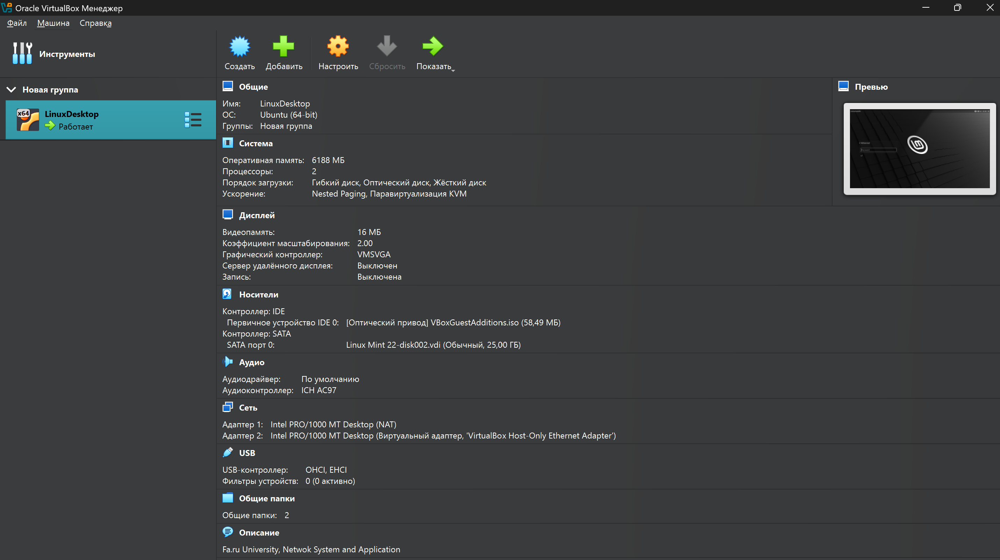

<div class="hero" markdown="1">
<p class="eyebrow">LX0 · Введение в Linux</p>

# Установка Linux в виртуальную машину

В конце занятия у вас будет **собственная Linux-машина и проверенная переносимая копия**. Вы установите Mint, выполните первые команды и научитесь сохранять готовую среду. Этот стенд понадобится во всех следующих работах.

Зачем разработчику Linux, как связаны темы курса и чем отличаются дистрибутивы — во [введении на главной странице]({{ '/' | relative_url }}#course-introduction). Здесь начнём с выбора способа запуска и перейдём к практике.

<p class="meta-line">Подготовка: около 10 минут · Практика: 90–120 минут без учёта загрузок · Основная среда: Linux Mint Cinnamon + VirtualBox</p>
</div>

<nav class="local-nav" aria-label="Содержание лабораторной">
<a href="#vm-containers">Как начать</a><a href="#install">Установка</a><a href="#verify">Проверка и OVA</a><a href="#quiz">10 вопросов</a><a href="#submit">Что сдавать</a><a href="#extras">По желанию</a>
</nav>

<section class="student-environment" aria-label="Среда курса">
  <div><span>Ваша учебная среда</span><strong>Windows PC → Oracle VirtualBox → Linux Mint 22.3 “Zena”</strong></div>
  <p>Администратор Windows <strong>не требуется для обычной работы курса</strong>. Команды Linux с <code>sudo</code> выполняются внутри Mint VM под вашим учебным Linux-пользователем.</p>
</section>








<h2 id="vm-containers">1. Как начать пользоваться Linux</h2>

В этой работе используем **Linux Mint Cinnamon в VirtualBox**. Mint откроется в отдельном окне, а Windows продолжит работать. Cinnamon — графический рабочий стол с меню и панелью задач; через него удобно начать знакомство с Linux.

**Хост** — ваш компьютер с Windows. **Гость** — Mint внутри виртуальной машины. VirtualBox предоставляет гостю виртуальные процессор, память, диск и сетевой адаптер.

### Какой способ подходит для вашей задачи

| Способ | Для чего подходит | Особенность |
|---|---|---|
| **Виртуальная машина: VirtualBox, VMware** | Установка и администрирование отдельной ОС | Своя гостевая ОС и ядро; ресурсы делятся с хостом. Наш основной маршрут — VirtualBox |
| **WSL 2** | Linux-команды и разработка рядом с Windows-приложениями | Настоящее ядро Linux в управляемой VM; запуск, устройства и сеть отличаются от обычного ПК |
| **Docker** | Повторяемое окружение приложения и его зависимостей | Процессы контейнеров используют общее ядро Linux; установка полной ОС не требуется |
| **Отдельная установка / dual boot** | Работа Linux непосредственно с оборудованием | При dual boot ОС выбирают при загрузке; настройка разделов и загрузчика требует больше внимания |
| **VPS/VDS или облачная VM** | Удалённый сервер, работающий независимо от ноутбука | Доступ по сети, обычно через SSH; условия и ресурсы зависят от провайдера |

WSL, Docker и отдельную установку можно попробовать дома как [необязательную практику](#extras). Для основной работы достаточно VirtualBox; облачный сервер арендовать не нужно.

### Почему начинаем с виртуальной машины

Вы увидите весь путь: загрузка установщика → установка Linux → первые команды → перенос готовой системы. **Преимущество VM** — отдельная учебная среда, которую можно копировать и восстанавливать. **Ограничение** — она использует память, процессор и диск вашего ПК; работа двух гостей требует больше ресурсов.

Установщик будет работать с новым виртуальным диском, созданным для занятия. Общие папки и сеть всё же связывают гостя с другими системами: изоляция не означает, что любые действия безопасны.

### VM, WSL 2 и контейнеры — что важно сейчас

**VM** загружает отдельную гостевую ОС со своим ядром. **WSL 2** даёт Linux-среду рядом с Windows через управляемую виртуализацию. **Linux-контейнеры** изолируют процессы, но используют ядро Linux-среды, в которой запущены. Для LX0 нужен именно полный цикл VM: установка → проверка → экспорт → импорт.

<details class="concept-details" markdown="1">
<summary>Разобрать подробнее: чем VM отличается от контейнера и облачной VM</summary>

<figure class="architecture" aria-labelledby="arch-caption">
<div class="architecture-grid">
<section class="stack-card vm-stack">
<h3>Две виртуальные машины</h3>
<div class="stack-pair"><div>Приложения Mint<strong>Ядро гостя A</strong></div><div>Приложения Ubuntu<strong>Ядро гостя B</strong></div></div>
<div class="stack-layer">VirtualBox · виртуальное оборудование</div>
<div class="stack-layer base-layer">Windows · физический компьютер</div>
<p>Каждая VM загружает собственную ОС.</p>
</section>
<section class="stack-card container-stack">
<h3>Два Linux-контейнера</h3>
<div class="stack-pair"><div>Приложение A<strong>Его библиотеки</strong></div><div>Приложение B<strong>Его библиотеки</strong></div></div>
<div class="stack-layer">Средства запуска и изоляции контейнеров</div>
<div class="stack-layer shared-kernel">Общее ядро Linux</div>
<div class="stack-layer base-layer">Linux-хост или Linux-VM на Windows</div>
<p>Ядро общее, окружения процессов разделены.</p>
</section>
</div>
<figcaption id="arch-caption">Упрощённая схема. На Windows Docker Desktop запускает Linux-контейнеры через Linux-среду, например WSL 2; Linux-контейнеры не используют ядро Windows как своё ядро.</figcaption>
</figure>

| Критерий | Виртуальная машина | Linux-контейнер |
|---|---|---|
| Что запускается | Гостевая ОС и её службы | Процессы приложения и зависимости |
| Ядро | Своё у каждой VM | Общее ядро Linux-хоста или Linux-VM |
| Ресурсы | Память и диск нужны ОС и приложениям | Обычно меньше накладных расходов; на Windows учитывается и Linux-среда |
| Перенос | OVA: конфигурация VM и виртуальные диски | Образ приложения; постоянные данные обычно хранят отдельно |
| Учебная задача | Установить ОС и изучить её работу | Запустить приложение с нужными зависимостями |

При подключении к VPS по **SSH** команды выполняются на удалённом сервере; ноутбук показывает клиентский терминал. Облако определяет место размещения системы, а контейнеризация — способ упаковки и запуска приложения. SSH освоим в LX2.

[Контейнеры Docker](https://docs.docker.com/get-started/docker-concepts/the-basics/what-is-a-container/) · [WSL 2](https://learn.microsoft.com/en-us/windows/wsl/about)

</details>

<h2 id="install">2. Практика: установка Linux в виртуальную машину</h2>

Выполняйте действия по порядку. У каждого этапа есть наблюдаемый результат; если он отличается, воспользуйтесь [подсказками](#troubleshooting).

Академическая основа: [лабораторная «Установка Linux в виртуальную машину»](https://koroteev.site/text/os00-1/).

### Цель работы

Освоить основные приёмы управления виртуальной машиной: создание, запуск, корректное выключение и удаление. Установить Linux Mint на виртуальный диск, затем экспортировать подготовленную среду в OVA и проверить её восстановление на примере второй VM.

### Основное задание

Работайте по **пяти этапам в зелёном маршруте сверху**. Внутри них находятся десять небольших действий: установить Mint, проверить её, экспортировать OVA, восстановить копию, запустить две VM и безопасно удалить только тестовую копию.

<details class="task-map" markdown="1">
<summary>Показать полный список 10 действий</summary>

| № | Действие | Что проверить |
|---|---|---|
| 1 | Скачать Linux Mint | официальный ISO и контрольная сумма |
| 2 | Создать VM | CPU, RAM, новый VDI и NAT |
| 3 | Запустить VM | live-система с ISO |
| 4 | Установить Linux | загрузка с VDI без ISO |
| 5 | Выключить VM | состояние Powered Off |
| 6 | Экспортировать OVA | отдельный файл ненулевого размера |
| 7 | Импортировать OVA | отдельная восстановленная VM |
| 8 | Переименовать копию | две VM легко различить |
| 9 | Запустить обе VM | обе имеют состояние Running |
| 10 | Удалить только копию | оригинал и OVA сохранены |

</details>

После установки, перед экспортом, сохраните короткий паспорт среды. Он позволит проверить, что после импорта восстановлена именно ваша работа.

### Подготовка

В этой версии курса используем **Linux Mint 22.3 «Zena» Cinnamon**. Перед занятием откройте [официальную страницу загрузки](https://linuxmint.com/download.php): если преподаватель не объявил обновление образа, используйте именно версию курса и не берите Beta. Единый образ у всей группы упрощает диагностику.

Маршрут рассчитан на **Windows-ПК с Intel/AMD x86-64**. Для Windows ARM или Apple Silicon заранее согласуйте с преподавателем совместимую среду.

Это рекомендуемые настройки учебного стенда. Для этапа с двумя VM понадобятся ресурсы двух гостей одновременно: если ноутбук слабый, заранее договоритесь об использовании компьютера аудитории.

| Компьютер | Настройки гостевой VM |
|---|---|
| Хост с 8 ГБ RAM | 2–3 ГБ гостю; перед запуском двух VM уменьшите обе примерно до **2 ГБ**, закройте тяжёлые приложения |
| Хост с 16 ГБ RAM и более | **4 ГБ** на VM обычно достаточно; не отдавайте гостям всю память хоста |
| Процессор | Начните с **2 vCPU** и оставьте ресурсы Windows |
| Диск | Новый динамический VDI **50 ГБ**; на хосте дополнительно нужны место для ISO, OVA и импортированной копии |
| Экран | VMSVGA, 128 МБ видеопамяти, 3D-ускорение выключено, Nested Paging включён |
| Сеть | Adapter 1: **NAT**, виртуальный кабель подключён |

В Windows откройте **Диспетчер задач → Производительность → ЦП** и проверьте строку «Виртуализация». Если она выключена, включите Intel VT-x / AMD-V в UEFI по инструкции производителя ПК. На управляемом университетском компьютере обратитесь к администратору.

<details class="concept-details" markdown="1">
<summary>Если VirtualBox работает нестабильно: совместимость Mint 22.3</summary>

Для Mint 22.3 как гостевой системы официальные Release Notes рекомендуют VMSVGA, 128 МБ видеопамяти, отключённое 3D-ускорение и включённый Nested Paging. Там же описаны известные проблемы некоторых конфигураций VirtualBox с HWE-ядром 6.14. **Не меняйте ядро или функции защиты Windows наугад:** сохраните точный текст ошибки и сверяйтесь с единым решением группы. [Linux Mint 22.3 Release Notes](https://linuxmint.com/rel_zena.php).

</details>

<h3 id="core-download">Шаг 1. Скачайте и проверьте образ</h3>

<p class="stage-goal"><strong>Готово, когда:</strong> ISO Linux Mint скачан с официального сайта; контрольная сумма совпадает.</p>

1. Откройте [страницу VirtualBox](https://www.virtualbox.org/wiki/Downloads), скачайте пакет **Windows hosts** и установите его. Extension Pack для этой лабораторной не требуется.
2. Откройте [Linux Mint](https://linuxmint.com/download.php), выберите **Cinnamon**, затем зеркало загрузки ISO.
3. Сохраните ISO в отдельный каталог. Скачайте соответствующий `sha256sum.txt` через ссылку проверки образа на странице выпуска.
4. В **PowerShell Windows** выполните команду, подставив путь к скачанному ISO:

```powershell
Get-FileHash "$env:USERPROFILE\Downloads\linuxmint-22.3-cinnamon-64bit.iso" -Algorithm SHA256
```

Сравните все символы результата со строкой **этого же файла** в `sha256sum.txt`. Несовпадение означает, что этот ISO использовать нельзя. Контрольная сумма проверяет целостность; проверка подписи файла сумм дополнительно подтверждает его происхождение: [официальная инструкция проверки](https://linuxmint-installation-guide.readthedocs.io/en/latest/verify.html).

**Различайте файлы:** ISO — установочный носитель, VDI — диск вашей VM, OVA — переносимый пакет уже настроенной виртуальной машины.

<h3 id="core-create">Шаг 2. Создайте гостевую VM</h3>

<p class="stage-goal"><strong>Готово, когда:</strong> В VirtualBox есть новая VM с нужными CPU, RAM, VDI и NAT.</p>

1. Откройте **VirtualBox → New / Создать**.
2. В поле имени введите `linux-lx0-myname`, обязательно заменив `myname` своей фамилией латиницей.
3. Выберите скачанный ISO. Тип ОС — **Linux**, вариант — **Ubuntu (64-bit)**.
4. Включите **Skip Unattended Installation / Пропустить автоматическую установку**, если этот пункт доступен: установку выполним вручную. Названия полей зависят от версии VirtualBox.
5. Задайте RAM и CPU по таблице, создайте **новый**, а не существующий, динамический VDI на **50 ГБ**. Динамический VDI имеет заданный максимальный размер, но файл на хосте растёт по мере записи данных.
6. Перед запуском проверьте **Settings → Storage**: ISO в оптическом приводе, новый VDI — основной диск. В **Network** оставьте NAT.
<h3 id="core-start">Шаг 3. Запустите VM с установочного ISO</h3>

<p class="stage-goal"><strong>Готово, когда:</strong> Открылась live-среда Mint и доступен запуск установщика.</p>

Выделите созданную VM и нажмите **Start / Запустить**. При появлении меню ISO выберите запуск Linux Mint. Дождитесь рабочего стола live-системы.

**Контрольная точка:** Mint работает в окне VirtualBox, но пока загружен с ISO. Установка на VDI ещё впереди. NAT обеспечивает исходящие подключения через хост; входящий SSH позже потребует проброса порта или другого режима сети.

<h3 id="core-install">Шаг 4. Установите Linux на виртуальный диск</h3>

<p class="stage-goal"><strong>Готово, когда:</strong> Mint загружается с VDI без ISO; вы можете войти под своим пользователем.</p>

**Установка ОС** записывает систему на виртуальный диск и настраивает загрузку и учётную запись. После неё Mint должен запускаться с VDI без установочного ISO.

1. Внутри окна Mint дважды нажмите **Install Linux Mint**.
2. Выберите язык, раскладку клавиатуры и часовой пояс.
3. Для созданного **пустого виртуального диска** выберите **Erase disk and install Linux Mint / Стереть диск и установить Linux Mint**.
4. Перед подтверждением проверьте размер целевого диска: он должен соответствовать вашему VDI, например 50 ГБ.
5. Создайте учётную запись и введите свои реальные данные. Метку `myname` ниже не оставляйте буквально — замените её своей фамилией латиницей:

| Поле | Что вводить |
|---|---|
| Ваше имя | ваши реальные имя и фамилия |
| Имя пользователя | ваша фамилия латиницей, например по шаблону `myname` |
| Имя компьютера | ваша фамилия латиницей + `-lx0`, например по шаблону `myname-lx0` |
| Вход | Требовать пароль; придумайте собственный пароль |

6. Дождитесь завершения, нажмите **Restart Now**. При запросе извлеките ISO через **Devices → Optical Drives → Remove disk from virtual drive**, затем нажмите Enter.
7. Войдите под своей учётной записью.

<div class="callout warning" markdown="1">
**Перед подтверждением:** вы находитесь в окне VirtualBox и выбрали новый пустой VDI. Кнопка «Стереть диск» на физическом компьютере может удалить Windows и данные; здесь работаем только с учебным виртуальным диском.

</div>

**Проверка:** система запускается без установочного ISO и предлагает вход в созданную учётную запись. [Руководство установщика Mint](https://linuxmint-installation-guide.readthedocs.io/en/latest/install.html).


Откройте терминал Mint сочетанием **Ctrl+Alt+T** и по очереди выполните `whoami` и `hostname`. Они покажут ваше имя пользователя и имя Linux-машины.

<p class="evidence-note" data-evidence-kind="screenshot" data-evidence-id="LX0-01"><strong>В отчёт · LX0-01.</strong> Сделайте один снимок: окно VirtualBox с установленной Mint и терминалом, где видны <code>whoami</code> и <code>hostname</code>. ISO уже извлечён.</p>

#### Организуйте рабочее место курса

До следующих команд создайте постоянную папку курса в своём домашнем каталоге. Во всех лабораторных используем одну схему:

```text
~/NSA/
├── LX0/   ← текущая лабораторная
├── LX1/   ← появится в LX1
├── LX2/   ← появится в LX2
└── ...
```

Создавайте папку только для текущей лабораторной; будущие каталоги заранее не нужны. Linux различает регистр символов, поэтому используйте именно <code>NSA</code> и <code>LX0</code>.

Создайте каталог LX0:

```bash
mkdir -p ~/NSA/LX0
```

Перейдите в него:

```bash
cd ~/NSA/LX0
```

Проверьте, где вы находитесь:

```bash
pwd
```

Ожидаемый конец пути: <code>/NSA/LX0</code>. Знак <code>~</code> означает домашний каталог текущего пользователя, поэтому полный путь обычно выглядит как <code>/home/ваш_логин/NSA/LX0</code>.

#### Первые команды: спросите систему о себе

Далее команды выполняются **в терминале Mint**. Вводите их по одной и сравнивайте вывод с пояснениями. Символ приглашения `$` вводить не нужно.

| Команда | Какой вопрос вы задаёте системе |
|---|---|
| `whoami` | От имени какого пользователя я работаю? |
| `hostname` | На какой машине я нахожусь? |
| `pwd` | Какой каталог сейчас выбран? |
| `uname -a` | Какое ядро и архитектура используются? |
| `cat /etc/os-release` | Какой дистрибутив установлен? |
| `ip -br a` | Какие интерфейсы и адреса есть у системы? |
| `ip a` | Как выглядит подробная информация об интерфейсах? |
| `ping -c 4 linuxmint.com` | Отвечает ли этот узел на четыре ICMP-запроса? |

Адрес `127.0.0.1` относится к самой машине. У другого интерфейса ищите адрес локальной сети, часто `10.0.2.15` при стандартном NAT VirtualBox; точное значение может отличаться. Отсутствие ответов на `ping` само по себе ещё не доказывает отсутствие интернета: ICMP может фильтроваться.

Затем обновите сведения о пакетах и установленные программы:

```bash
sudo apt update
sudo apt upgrade
```

`update` получает новые списки пакетов, `upgrade` предлагает установить доступные обновления. Прочитайте список изменений перед подтверждением. `sudo` запускает эту команду с административными правами. Введите пароль своей учётной записи Mint и нажмите Enter; символы пароля обычно не отображаются. Дождитесь завершения. Если Mint рекомендует перезагрузку, выполните её через меню системы.

#### Если окно VM неудобно

Попробуйте изменить размер окна VM. Если разрешение подстраивается и указатель мыши работает нормально, переходите дальше. **Guest Additions** — драйверы и службы интеграции; они не заменяют саму гостевую ОС.

<details markdown="1">
<summary>Если нужны Guest Additions: установка и проверка</summary>

1. После обновлений перезагрузите Mint и создайте снимок VM через менеджер VirtualBox. Не смешивайте без необходимости установку из репозитория с установщиком Oracle.
2. В терминале Mint установите средства сборки модулей для текущего ядра:

```bash
sudo apt install build-essential dkms linux-headers-$(uname -r)
```

3. В меню окна VM выберите **Devices → Insert Guest Additions CD image**. Используется ISO дополнений от установленной версии VirtualBox.
4. В файловом менеджере Mint откройте появившийся CD. Щёлкните в его каталоге правой кнопкой → **Open in Terminal**. Проверьте `ls`: здесь должен быть файл `VBoxLinuxAdditions.run`.
5. Запустите:

```bash
sudo sh ./VBoxLinuxAdditions.run
```

6. Дождитесь завершения без ошибок сборки, перезагрузите Mint и снова измените размер окна. Общий буфер обмена включается отдельно в **Devices → Shared Clipboard**, если он нужен.

Если заголовки ядра не найдены, проверьте завершение обновлений и повторную загрузку с новым ядром. При ошибке сохраните её текст; для командной строки и сдачи основной работы дополнения не обязательны. Общие папки и буфер обмена создают дополнительные связи с хостом.

Источник: [Oracle Guest Additions](https://docs.oracle.com/en/virtualization/virtualbox/7.2/user/guestadditions.html).

</details>

#### Создайте первый файл

Сначала посмотрите домашний каталог:

```bash
cd ~
pwd
ls
```

`~` обозначает ваш домашний каталог. Чтобы перейти на рабочий стол независимо от языка интерфейса Mint:

```bash
cd "$(xdg-user-dir DESKTOP)"
pwd
ls
cd ~
```

Оболочка сначала выполняет команду внутри `$(...)`, затем подставляет её результат. Кавычки сохраняют путь с пробелами как одно значение. Если `xdg-user-dir` недоступна, посмотрите `ls ~` и перейдите в существующий `Desktop` или `Рабочий стол` вручную.

Создайте каталог практики и файл. `mkdir -p` создаёт каталог, `cd` переходит в него, `echo` выводит строку, а `cat` показывает содержимое файла:

```bash
mkdir -p ~/NSA/LX0/check
cd ~/NSA/LX0/check
echo "Linux lab by $(whoami) on $(hostname)" > hello.txt
cat hello.txt
```

`>` направляет вывод в файл и **заменяет его прежнее содержимое**, если файл уже существует. Здесь имя специально выбрано для учебного файла.

<p class="lab-tip"><strong>Проверка без отчёта.</strong> Убедитесь, что <code>hello.txt</code> читается. Этого достаточно для основной работы.</p>

<details class="optional-work" markdown="1">
<summary>По желанию · установить маленькую программу из репозитория</summary>

Если осталось время, установите две демонстрационные программы и запустите их:

```bash
sudo apt install cowsay figlet
figlet Linux
/usr/games/cowsay "Hello, Linux!"
```

Это дополнительная мини-практика с APT; в отчёт её включать не нужно.

</details>

<h2 id="verify">3. Проверьте систему и переносимость VM</h2>

### Соберите паспорт среды

В терминале **установленной VM** выполните блок целиком:

```bash
mkdir -p ~/NSA/LX0/check
{
  echo "USER=$(whoami)"
  echo "HOST=$(hostname)"
  echo "--- OS ---"
  cat /etc/os-release
  echo "--- KERNEL ---"
  uname -a
  echo "--- IP ---"
  ip -br a
} | tee ~/NSA/LX0/check/verification.txt
```

Фигурные скобки объединяют команды; `|` передаёт общий вывод программе `tee`, которая одновременно показывает его и сохраняет в файл. Повторный запуск заменит этот учебный отчёт.

**Проверьте:** логин и hostname ваши; дистрибутив — Mint; есть версия ядра и список интерфейсов. Сопоставьте каждую строку с командой, которая её вывела. Для отчёта используйте текст, а не снимок экрана.


<p class="evidence-note" data-evidence-kind="text" data-evidence-id="LX0-02"><strong>В отчёт · LX0-02.</strong> Выполните <code>cat ~/NSA/LX0/check/verification.txt</code> и вставьте вывод в поле ниже. Это лучше, чем снимок экрана: текст остаётся читаемым и проверяемым.</p>
<div class="evidence-editor evidence-editor-static" data-evidence-editor="LX0-02">
  <label for="evidence-LX0-02">Поле для результата · LX0-02</label>
  <p class="evidence-editor-help" data-evidence-help>Вставьте сюда только запрошенный вывод команд как обычный текст. Поле не является формой и само ничего не отправляет.</p>
  <textarea id="evidence-LX0-02" rows="6" maxlength="6000" spellcheck="false" autocomplete="off" autocapitalize="off" data-evidence-id="LX0-02" placeholder="Вставьте сюда результат из терминала…"></textarea>
  <div class="evidence-editor-meta"><span data-evidence-count>0 / 6000</span><span class="evidence-local-badge">Только в этой вкладке</span></div>
  <div class="evidence-editor-actions">
    <button type="button" data-evidence-copy>Копировать</button>
    <button type="button" class="secondary-action" data-evidence-clear>Очистить</button>
    <span class="evidence-editor-status" data-evidence-status aria-live="polite"></span>
  </div>
</div>

<h3 id="core-shutdown">Шаг 5. Корректно выключите Linux</h3>

<p class="stage-goal"><strong>Готово, когда:</strong> VirtualBox показывает состояние Powered Off, а не Saved.</p>

Сохраните `hello.txt` и `verification.txt`, завершите обновления. В меню Mint выберите **Shut Down / Выключить**. В менеджере VirtualBox дождитесь состояния **Powered Off / Выключена**.

Закрытие окна VM может предложить разные действия. **Save the machine state / Сохранить состояние** приостанавливает машину, а **Power Off / Выключить питание** соответствует резкому отключению питания. Для этой работы используйте штатное завершение работы гостевой ОС. Экспорт начинайте после её выключения.

<h3 id="core-export">Шаг 6. Экспортируйте машину в OVA</h3>

<p class="stage-goal"><strong>Готово, когда:</strong> Файл OVA создан и имеет ненулевой размер.</p>

1. В менеджере VirtualBox откройте **File → Export Appliance / Экспорт конфигураций** и выберите свою исходную учебную VM.
2. Выберите экспорт в локальный файл, задайте имя `lx0-myname.ova`, заменив `myname` своей фамилией. Сохраните OVA **в отдельную папку вне каталогов обеих VM**, например `Documents/LX0-export`.
3. Запустите экспорт и дождитесь завершения. Проверьте в Проводнике, что файл `.ova` существует и имеет ненулевой размер; запишите размер одной строкой. Отдельный снимок экрана здесь не нужен: исправность экспорта подтверждается успешным импортом и загрузкой.

**Что содержится в OVA:** описание виртуального оборудования и экспортированные виртуальные диски. На диске уже находятся Linux, пользователь и ваши файлы. OVA используют для переноса и развёртывания подготовленной среды. Изменения исходной VM после экспорта в этот файл автоматически не попадают; перенос состояния работающей оперативной памяти в этой работе не выполняется.

<h3 id="core-import">Шаг 7. Создайте вторую машину из OVA</h3>

<p class="stage-goal"><strong>Готово, когда:</strong> В менеджере VirtualBox появились исходная VM и импортированная копия.</p>

1. Выберите **File → Import Appliance / Импорт конфигураций**, укажите созданный OVA.
2. Проверьте импортируемые настройки и выберите **отдельный каталог для новой VM**. Исходная VM должна остаться на месте. Не подключайте к копии существующий VDI оригинала вручную.
3. Если предлагается политика MAC-адресов, сгенерируйте новые адреса для сетевых адаптеров импортируемой машины.
4. Завершите импорт. В списке VirtualBox должны быть **две отдельные VM**. Если программа требует уникальное имя при импорте, временно задайте `linux-lx0-myname-import`.

Создание пустой VM и повторная установка с ISO не заменяют этот шаг: вторая машина должна быть восстановлена именно из экспортированного OVA.

<h3 id="core-rename">Шаг 8. Переименуйте вторую машину</h3>

<p class="stage-goal"><strong>Готово, когда:</strong> У копии другое имя в VirtualBox, поэтому две VM легко различить.</p>

1. Выделите **импортированную** VM, пока она выключена. Откройте **Settings → General → Basic → Name / Настройки → Общие → Основные → Имя**; в зависимости от версии поле имени может находиться в обновлённом окне настроек.
2. Установите имя `linux-lx0-myname-copy`. У исходной VM имя не меняйте. Проверьте список менеджера: названия различаются.
3. Откройте для копии **Show in Explorer / Показать в проводнике** или сведения о её расположении. Запишите фактический каталог копии **после переименования**: он понадобится для проверки удаления. Убедитесь, что он отличается от каталога оригинала и папки OVA.
4. Запустите копию. Выполните в ней `whoami`, `hostname`, `cat ~/NSA/LX0/check/hello.txt`. Пользователь и файл должны сохраниться после импорта.

**Имя VM и hostname — разные настройки.** Имя в VirtualBox должно измениться, а Linux-hostname после импорта может остаться прежним: это нормально.

<p class="evidence-note" data-evidence-kind="screenshot" data-evidence-id="LX0-03"><strong>В отчёт · LX0-03.</strong> Сделайте один снимок после запуска копии: в VirtualBox видны исходная VM и VM с суффиксом <code>-copy</code>; в терминале копии видны <code>whoami</code>, <code>hostname</code> и <code>cat ~/NSA/LX0/check/hello.txt</code>. В подписи добавьте размер OVA.</p>

<details markdown="1">
<summary>По желанию: задайте копии отдельный hostname</summary>

Это не требуется для зачёта шага. Выполните только в копии, заменив `myname` своей фамилией:

```bash
sudo hostnamectl set-hostname myname-lx0-copy
```

Только **в копии** откройте `sudo nano /etc/hosts`. В существующей строке `127.0.1.1` замените старый hostname на новый; строку `127.0.0.1 localhost` сохраните. Если строки `127.0.1.1` нет, добавьте `127.0.1.1 myname-lx0-copy`. Сохраните файл: Ctrl+O, Enter, Ctrl+X. Перезагрузите копию и повторите `hostname`.

</details>

<h3 id="core-run-both">Шаг 9. Запустите обе VM одновременно</h3>

<p class="stage-goal"><strong>Готово, когда:</strong> Обе VM одновременно имеют состояние Running.</p>

1. Проверьте, хватает ли хосту памяти для **двух гостей и Windows**. Например, две VM по 4 ГБ требуют 8 ГБ только для гостей, без учёта Windows и накладных расходов.
2. Запустите оригинал, затем копию. Дождитесь рабочего стола обеих машин. В менеджере у обеих должно быть состояние **Running / Работает**.
3. Расположите окна рядом. В терминале **каждой** VM выполните:

```bash
whoami
hostname
cat ~/NSA/LX0/check/hello.txt
```

4. <span class="evidence-inline evidence-screenshot" data-evidence-kind="screenshot" data-evidence-id="LX0-04"><strong>В отчёт · LX0-04.</strong> Сделайте снимок, на котором две отдельные VM одновременно имеют состояние <code>Running</code>. Если экран небольшой, допустимы два кадра <code>LX0-04a</code>/<code>LX0-04b</code>, но не фотографируйте каждую команду.</span>

**Что проверяем:** два отдельных экземпляра ОС работают одновременно, а подготовленные данные сохранились после переноса. Одинаковый адрес вроде `10.0.2.15` при обычном NAT у каждой VM не означает, что это одна машина: у них могут быть отдельные виртуальные NAT-сети.

Если ресурсов домашнего ПК недостаточно, сохраните OVA и выполните этот пункт на подходящем учебном компьютере, при необходимости импортировав там две копии. **Поочерёдная загрузка — промежуточная проверка; она не доказывает одновременную работу.** Укажите ограничение в отчёте и покажите совместный запуск преподавателю до завершения этого пункта. Не удаляйте единственную проверочную копию до сохранения нужных доказательств.

<h3 id="core-delete">Шаг 10. Удалите вторую VM вместе с её файлами</h3>

<p class="stage-goal"><strong>Готово, когда:</strong> Импортированная копия и её виртуальный диск удалены; оригинал и OVA сохранены.</p>

1. Убедитесь, что доказательства LX0-03 и LX0-04 сохранены. Штатно выключите копию; для удобства можно выключить и оригинал.
2. Сверьте **имя и фактический каталог** копии с записью из шага 8. OVA лежит отдельно, оригинал использует свой диск.
3. Выделите **только `linux-lx0-myname-copy`** → **Remove / Удалить**. В диалоге выберите **Delete all files / Удалить все файлы**. Вариант **Remove only / Только убрать из списка** не выполняет задание: он оставляет файлы на диске.
4. После удаления проверьте менеджер VirtualBox: копии больше нет, оригинал остался. В проводнике проверьте записанный каталог копии: её конфигурация и импортированный виртуальный диск удалены; каталог обычно также удаляется. Если остались посторонние файлы, не удаляйте их вслепую — разберите их назначение.
5. Убедитесь, что экспортированный OVA сохранён. Запустите оригинал и прочитайте `~/NSA/LX0/check/hello.txt`: удаление копии не повредило исходную среду.
6. Убедитесь ещё раз: в менеджере осталась исходная VM, OVA лежит в отдельной папке, а каталог импортированной копии удалён. **Отдельное доказательство в отчёт не требуется** — это обязательная проверка безопасности перед завершением работы.

**Результат основной работы:** оригинал пригоден для LX1, OVA сохранён отдельно, импорт и совместный запуск проверены, вторая VM и принадлежащие ей файлы удалены. Снимок VM удобен для возврата к состоянию на том же хосте; отдельный проверенный экспорт решает другую задачу — перенос подготовленной среды. Если VM, снимки и OVA лежат на одном физическом диске, отказ этого диска может уничтожить их вместе; резервную копию для такого случая хранят на другом носителе.

Основа задания: [LX0 М. Коротеева](https://koroteev.site/text/os00-1/). Справочник: [Oracle VirtualBox](https://docs.oracle.com/en/virtualization/virtualbox/7.2/user/Introduction.html).

<h3 id="troubleshooting">Если результат отличается</h3>

| Симптом | Что проверить |
|---|---|
| VM не запускается | Текст ошибки, виртуализацию CPU и соответствие архитектуры ISO. Не отключайте функции защиты Windows наугад |
| Чёрный экран | Выключите VM; проверьте VMSVGA и попробуйте запуск без 3D |
| Снова появляется установщик | Извлеките ISO и загрузитесь с VDI |
| Нет доступа к сайтам | Виртуальный кабель, NAT, вывод `ip a` и `ip route`; проверьте также соединение хоста |
| `ping` не отвечает, но сайты открываются | Возможна фильтрация ICMP; это не обязательно ошибка VM |
| APT сообщает о блокировке | Дождитесь завершения другого менеджера обновлений; не удаляйте lock-файлы |
| Не получается `cd Desktop` | Используйте путь через `xdg-user-dir` или фактическое имя каталога из `ls ~` |

<h2 id="quiz">4. Короткая проверка: 10 вопросов</h2>

Все вопросы опираются на эту лабораторную: выбор VM, установка, первые команды и перенос среды. Отведите примерно **5–10 минут**. Ничего из дополнительных домашних маршрутов для теста выполнять не нужно.

В каждом вопросе один лучший ответ. После выбора появятся объяснение и ссылка на нужный раздел. Если вариант не подошёл, попробуйте другой — повторные попытки здесь нужны для обучения. После последнего вопроса итог MCQ сохранится локально и автоматически попадёт в готовый отчёт. Снимок экрана теста и ручное копирование результата не нужны.



<h2 id="submit">5. Что сдавать преподавателю</h2>



<div class="callout checkpoint" markdown="1">
**Готовы к LX1:** основная VM загружается без ISO, в ней есть ваш пользователь, файл проверки и доступ к репозиториям; перенос через OVA и одновременная работа двух VM проверены, копия удалена вместе с файлами. Теперь можно сосредоточиться на работе с файлами и командами — [перейти к LX1](lx1.html).

</div>

<h2 id="extras">6. По желанию: домашние задания</h2>

Основная работа завершена после практики, теста и отчёта. **Эти домашние задания необязательны:** выберите интересующий маршрут и покажите результат преподавателю. Дополнительные баллы зависят от выполненного задания и вашего объяснения; их количество определяет преподаватель.

Добавьте в конец PDF раздел «Дополнительная работа»: выбранный маршрут, шаги, возникшие трудности, результат и пронумерованные рисунки из таблицы ниже. В письме отметьте, что готовы продемонстрировать работу на занятии. Не устанавливайте вторую ОС на компьютер с важными данными только ради баллов: можно выбрать WSL, Docker или учебную VM.

<details markdown="1">
<summary>Какие доказательства подготовить за дополнительную работу</summary>

| Маршрут | Дополнительные рисунки | Что показать преподавателю |
|---|---|---|
| А · WSL 2 | **LX0-A1:** `wsl --list --verbose` и сведения о Linux. **LX0-A2:** файл читается после завершения и повторного запуска дистрибутива | Запуск WSL, сохранённый файл; объяснить роль ядра Linux и управляемой VM |
| Б · Docker | **LX0-B1:** окружение и ядро контейнера. **LX0-B2:** оба файла после остановки и запуска. **LX0-B3:** файл тома сохранён после удаления контейнера, файл его слоя отсутствует | Различие образа, контейнера и тома; снять доказательства **до очистки тома** |
| В · Отдельная установка / dual boot | **LX0-C1:** выбранный диск и разделы без секретных данных. **LX0-C2:** установленный Mint и паспорт после загрузки без USB. **LX0-C3:** загрузка Windows, только если выбран dual boot | Рабочую установленную систему; для dual boot — загрузку обеих ОС. Один подготовительный план не подтверждает завершённую установку |
| Г · Учебная разметка в VM | **LX0-D1:** схема разделов. **LX0-D2:** загрузка Mint и сохранённый `keep.txt` на NTFS | Объяснить, как сохранён NTFS-раздел; зафиксировать результат **до удаления тестовой VM** |

</details>

Выберите один из закрытых блоков ниже, если хотите продолжить самостоятельно.

<details class="extra-task" markdown="1">
<summary>Необязательно · доп. баллы · А · WSL 2 — Linux-инструменты рядом с Windows · 20–30 минут</summary>

### Что проверим

Запустим Ubuntu в WSL 2, создадим файл в Linux и откроем его каталог из Windows. Это удобно для Bash, Git и Python без отдельного рабочего стола. В WSL 2 работает настоящее ядро Linux в управляемой виртуальной машине; сеть и жизненный цикл среды отличаются от VirtualBox.

### 1. Установите WSL

На поддерживаемой Windows 11 откройте **Терминал / PowerShell от имени администратора**. Не вводите эти команды внутри Mint. Если WSL уже установлен, сначала посмотрите существующие дистрибутивы, не удаляя их:

```powershell
wsl --list --verbose
wsl --list --online
```

Для новой установки Ubuntu выполните:

```powershell
wsl --install -d Ubuntu
```

Перезагрузите Windows, если это запрошено. Откройте **Ubuntu** через меню «Пуск» и создайте Linux-логин с вашей фамилией и собственный пароль. Эта учётная запись отдельна от учётной записи Windows.

### 2. Убедитесь, что это WSL 2

В **PowerShell**:

```powershell
wsl --update
wsl --list --verbose
```

В столбце VERSION для Ubuntu должно быть `2`. Если указано `1`, выполните `wsl --set-version Ubuntu 2`; при другом имени дистрибутива используйте точное имя из списка. Если Windows предлагает включить компоненты виртуализации, следуйте [инструкции Microsoft](https://learn.microsoft.com/en-us/windows/wsl/install).

### 3. Создайте файл в Linux

В окне **Ubuntu / Bash**, обычный пользователь:

```bash
whoami
cat /etc/os-release
uname -r
sudo apt update
sudo apt upgrade
mkdir -p ~/NSA/LX0/WSL
cd ~/NSA/LX0/WSL
echo "Linux tools beside Windows" > hello.txt
cat hello.txt
explorer.exe .
```

Точка означает текущий каталог. Проводник Windows должен открыть Linux-каталог с `hello.txt`. Для Linux-проектов начните с `~`, а не с `/mnt/c`: это помогает не смешивать особенности двух файловых систем.

### 4. Завершите и вернитесь

Введите `exit` в Ubuntu. Это закрывает оболочку; среда может продолжать работать. Для её остановки сохраните файлы и выполните в PowerShell `wsl --terminate Ubuntu`. Для нового входа — `wsl -d Ubuntu`. После входа `cat ~/NSA/LX0/WSL/hello.txt` должен показать сохранённую строку. Не используйте `wsl --unregister` для выхода: эта команда удаляет дистрибутив с его данными.

**Результат:** снимок экрана с `wsl --list --verbose`, вывод трёх диагностических команд и сохранённый файл. Объясните, почему WSL 2 использует виртуализацию, хотя вы не настраивали VM вручную.

Если установка зависла при загрузке, Microsoft описывает вариант `wsl --install --web-download -d Ubuntu`. При ограничениях учебного ПК обратитесь к администратору.

Источники: [установка WSL](https://learn.microsoft.com/en-us/windows/wsl/install), [команды WSL](https://learn.microsoft.com/en-us/windows/wsl/basic-commands), [файловые системы](https://learn.microsoft.com/en-us/windows/wsl/filesystems).

</details>

<details class="extra-task" markdown="1">
<summary>Необязательно · доп. баллы · Б · Docker — окружение приложения и сохранение данных · 25–35 минут</summary>

### Что проверим

Создадим контейнер Ubuntu, сравним сведения об окружении и ядре, затем проверим, какие файлы сохраняются после удаления контейнера. Это учебный запуск оболочки; рабочие приложения обычно упаковывают заранее в образ.

### 1. Подготовьте Docker Desktop на Windows

1. Выполните подготовку WSL 2 из предыдущего блока. Проверьте требования вашей версии Windows на [странице Docker Desktop](https://docs.docker.com/desktop/setup/install/windows-install/).
2. Скачайте подходящий установщик, запустите его и выберите **WSL 2 backend**, если предлагается выбор.
3. Откройте Docker Desktop, ознакомьтесь с условиями использования и дождитесь готовности движка. Используйте режим **Linux containers**.
4. В обычном **PowerShell Windows** выполните:

```powershell
docker version
docker run --rm hello-world
```

Ожидается информация о клиенте **и сервере**, затем тестовое сообщение. Ошибка подключения к daemon обычно означает, что движок ещё не запущен. Здесь не требуется устанавливать второй Docker Engine внутри Mint или WSL.

### 2. Создайте отдельный том и контейнер

Все команды `docker ...` ниже выполняйте в **PowerShell**, а команды внутри контейнера — в появившейся **Bash-оболочке**.

```powershell
docker volume create lx0-data
docker run -it --name lx0-box --mount source=lx0-data,target=/work ubuntu:24.04 bash
```

`ubuntu:24.04` — образ пользовательского окружения. `-it` открывает интерактивный терминал, `--name` задаёт имя, `--mount` подключает том к `/work`. При первом запуске образ скачивается.

Внутри контейнера выполните:

```bash
whoami
cat /etc/os-release
uname -r
echo "saved in volume" > /work/kept.txt
echo "saved in container layer" > /tmp/local.txt
exit
```

По умолчанию этот образ запускает оболочку от `root`, поэтому `sudo` не нужен. Это **не рекомендация** запускать рабочие приложения от root. Выход из единственной основной оболочки останавливает этот контейнер.

### 3. Отличите остановку от удаления

В PowerShell:

```powershell
docker ps -a --filter name=lx0-box
docker start -ai lx0-box
```

В возобновившейся Bash-оболочке:

```bash
cat /work/kept.txt
cat /tmp/local.txt
exit
```

Оба файла пока существуют: контейнер был остановлен, но не удалён. Теперь в **PowerShell** удалите именно учебный контейнер и создайте новый с прежним томом:

```powershell
docker rm lx0-box
docker run --rm --mount source=lx0-data,target=/work ubuntu:24.04 cat /work/kept.txt
docker run --rm ubuntu:24.04 cat /tmp/local.txt
```

Первая команда чтения выводит `saved in volume`. Вторая намеренно завершается ошибкой `No such file or directory`: файл находился в слое удалённого контейнера. `--rm` автоматически удаляет эти одноразовые контейнеры после завершения команды; именованный том остаётся.

### 4. Завершите опыт

Сначала сохраните нужные снимки экрана. Если учебный файл больше не нужен, удалите **только созданный здесь том**:

```powershell
docker volume rm lx0-data
```

Эта команда окончательно удаляет данные тома. Не используйте общую очистку `prune`: она может затронуть другие проекты. Если имя `lx0-box` уже занято, посмотрите `docker ps -a` и выберите другое имя вместо удаления незнакомого контейнера.

**Результат:** снимки экрана проверки ядра и двух опытов с файлами. Ответьте: что пережило остановку, что пережило удаление и почему? Почему контейнер Ubuntu на Windows не загружает собственное ядро из образа?

Источники: [запуск контейнеров](https://docs.docker.com/engine/containers/run/), [именованные тома](https://docs.docker.com/engine/storage/volumes/), [Docker Desktop и WSL](https://docs.docker.com/desktop/features/wsl/).

</details>

<details class="extra-task" markdown="1">
<summary>Необязательно · доп. баллы · В · Linux на отдельном компьютере или диске · 45–90 минут</summary>

### Что изменится

При прямой установке Linux управляет физическим оборудованием. Это полезно для знакомства с драйверами и повседневной работы в Linux. Здесь **нет защиты виртуального диска**: выбор целевого устройства влияет на реальные данные.

Для первого опыта используйте **запасной компьютер с пустым диском**. Если нужных условий нет, остановитесь после подготовки плана — основная VM уже обеспечивает выполнение лабораторной.

### 1. Подготовьте оборудование и резервную копию

1. Сохраните важные файлы на другом носителе и проверьте, что они открываются. Если на ПК есть Windows с BitLocker / шифрованием устройства, заранее сохраните ключ восстановления.
2. Запишите модель и объём целевого диска. Для этого маршрута выбирается диск, на котором разрешено удалить все данные.
3. Подготовьте USB-накопитель от 8 ГБ. Его содержимое будет стёрто при записи образа.
4. Используйте проверенный ISO Mint из основного маршрута. Скачайте средство записи по ссылке в [официальном руководстве Mint](https://linuxmint-installation-guide.readthedocs.io/en/latest/burn.html).
5. В программе записи выберите **ISO → целевой USB → запись**. Перед подтверждением ещё раз проверьте модель и размер USB.

### 2. Сначала проверьте live-систему

1. Завершите работу компьютера, подключите USB и откройте меню загрузки. Клавиша зависит от производителя, например F12 или Esc.
2. Выберите USB в режиме **UEFI**, если компьютер использует UEFI. Не переключайте режимы загрузки и Secure Boot наугад.
3. Запустите Mint с USB. Пока не нажимайте кнопку установки.
4. Проверьте клавиатуру, экран, Wi-Fi / Ethernet и звук. Откройте терминал и выполните:

```bash
lsblk -o NAME,SIZE,MODEL,TYPE,MOUNTPOINTS
```

Сопоставьте модель и размер с целевым диском. Имена вроде `/dev/sda` или `/dev/nvme0n1` **не универсальны**. Если не можете однозначно отличить USB и диск для установки, не продолжайте.

### 3. Установите на пустой целевой диск

1. На запасном ПК с разрешённым к очистке диском откройте **Install Linux Mint**.
2. Задайте язык, раскладку, часовой пояс.
3. Выберите установку с очисткой **только проверенного целевого диска**. В окне подтверждения прочитайте список изменяемых разделов.
4. Если в списке появился диск с Windows или нужными данными — отмените действие. Если дисков несколько и назначение неясно, используйте помощь преподавателя.
5. Создайте пользователя и hostname, завершите установку, перезагрузите компьютер и извлеките USB по запросу.
6. Выполните обновления и блок «Паспорт среды» из основной работы. Проверьте повторную загрузку без USB и работу сети.

### Если хочется оставить Windows: dual boot

Dual boot — две установленные ОС, выбор одной при загрузке. Это отдельный сценарий, а не разрешение нажать «Стереть диск» на рабочем ПК.

1. Сделайте проверенную резервную копию и сохраните ключ восстановления шифрования.
2. Освободите место штатным средством Windows **Управление дисками → Сжать том**; оставьте его нераспределённым. Не удаляйте EFI-, Recovery- и Windows-разделы.
3. Завершите работу Windows полностью, без гибернации; учтите Fast Startup и требования установщика к BitLocker. Не обходите предупреждения о шифровании.
4. Загрузите USB в том же режиме UEFI, который использует Windows.
5. Продолжайте только если установщик правильно обнаружил Windows и предлагает понятную установку рядом, либо преподаватель проверил схему разделов. При отсутствии такого варианта **остановитесь**, а не переходите к произвольной ручной разметке.
6. После установки проверьте загрузку обеих ОС и доступность файлов. При проблемах используйте [руководство Mint по multiboot](https://linuxmint-installation-guide.readthedocs.io/en/latest/multiboot.html), не форматируйте разделы повторно.

**Результат:** паспорт среды и краткое описание выбранного диска, режима загрузки и проверки оборудования. Если выполняли только подготовку — сдайте план с объяснением, почему установку не продолжали. Фото ключей восстановления и паролей не прикладывайте.

Источники: [установка Mint](https://linuxmint-installation-guide.readthedocs.io/en/latest/install.html), [создание USB](https://linuxmint-installation-guide.readthedocs.io/en/latest/burn.html), [восстановление ключа BitLocker](https://support.microsoft.com/en-us/windows/find-your-bitlocker-recovery-key-6b71ad27-0b89-ea08-f143-056f5ab347d6).

</details>

<details class="extra-task" markdown="1">
<summary>Необязательно · доп. баллы · Г · Разметка без риска для Windows: дополнительное задание исходной LX0</summary>

Цель — установить Mint в свободное место виртуального диска, сохранив заранее созданный NTFS-раздел. Это моделирует часть задачи dual boot, **но не создаёт Windows** и не проверяет её загрузку.

1. Создайте отдельную VM `lx0-partitions-test` с **новым VDI на 50 ГиБ (51200 МиБ)**, не подключайте диск основной VM.
2. Загрузитесь с ISO Mint. Откройте **GParted** в live-системе, проверьте, что выбран новый пустой диск 50 ГиБ. Создайте таблицу разделов `msdos` для этой VM с выключенным EFI.
3. Создайте первичный раздел **NTFS на 30 ГиБ**. Остальное место оставьте нераспределённым. Примените операции. Размеры интерфейса могут быть в МиБ: 30 ГиБ = 30720 МиБ.
4. Смонтируйте NTFS-раздел через файловый менеджер и создайте `keep.txt` с произвольным текстом, затем размонтируйте его.
5. Запустите установщик, выберите ручную разметку **Something else**. В свободном месте создайте раздел ext4 с точкой монтирования `/`. NTFS не форматируйте. Загрузчик устанавливайте на целый виртуальный диск этой тестовой VM.
6. До подтверждения убедитесь: форматируется только новый ext4-раздел. Завершите установку и извлеките ISO.
7. В Mint проверьте разделы командой `lsblk -f`, откройте NTFS-раздел и прочитайте `keep.txt`.
8. Сохраните снимки экрана схемы и файла, выключите тестовую VM. После проверки удалите только эту тестовую VM, если она не нужна.

**Результат:** Mint загружается, NTFS-раздел и `keep.txt` сохранены. На настоящем ПК разметка сложнее: учитываются UEFI, шифрование, восстановление и уже установленные ОС. [Исходное задание](https://koroteev.site/text/os00-1/).

</details>


<section class="field-guide" data-field-guide>
  <div class="field-guide-head"><span>Когда что-то идёт не по плану</span><h3>Если VM не стартует</h3></div>
  <div class="hint-ladder">
    <details><summary>Сначала</summary><p>Прочитайте сообщение VirtualBox и определите: проблема возникает до загрузки ISO или уже внутри гостевой ОС.</p></details><details><summary>Проверьте</summary><p>Есть ли подключённый ISO, достаточно ли памяти и включена ли аппаратная виртуализация.</p></details><details><summary>Если всё ещё неясно</summary><p>Сохраните точный текст ошибки. Он полезнее, чем «не работает».</p></details>
  </div>
  <details class="diagnostic-moment">
    <summary>Быстрая диагностика: После перезапуска Mint снова показывает установщик. Какое предположение проверить первым?</summary>
    <p>ISO всё ещё подключён как загрузочный носитель.</p>
  </details>
</section>




<details class="lab-reflection"><summary>Одна мысль перед отчётом</summary><p>Какой один признак лучше всего убеждает вас, что эта VM готова стать рабочим стендом для следующих лабораторных?</p><p class="lab-reflection-note">Ответьте себе или добавьте короткое наблюдение в отчёт, если это помогает показать ход вашей работы.</p></details>

<section class="completion-summary" data-completion-summary aria-live="polite"></section>

<section class="finish-line"><span>Финишная проверка</span><p>Среда создана и проверена — теперь зафиксируйте результаты так, чтобы её можно было уверенно использовать дальше.</p></section>

<div class="report-review-strip" data-report-review aria-live="polite"><strong>Перед отчётом</strong><span>По мере выполнения здесь появится быстрая проверка ваших записей.</span></div>

